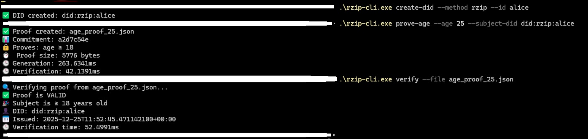

RZIP — протокол для децентрализованного управления цифровой идентичностью.

Позволяет субъектам генерировать, хранить и верифицировать утверждения (claims) о себе — например, возраст, гражданство, академические достижения — без зависимости от централизованных реестров или третьих сторон.

Верификация реализована через zero-knowledge proofs (ZKPs): проверяющая сторона может убедиться в корректности утверждения, не получая доступа к исходным данным и не требуя раскрытия личной информации. 
Схемы доказательств привязаны к криптографически производным идентификаторам (например, DID), контролируемым владельцем.

Проект находится на очень ранней стадии разработки.
Текущая цель — реализовать минимальный, но полноценный proof-of-concept, включающий:
    выпуск автономных верифицируемых учётных данных,  
    генерацию и проверку ZK-proof (например, age ≥ 18),  
    полный контроль пользователем над ключами и данными без внешних зависимостей.

Как и куда проект будет развиваться пока не известно. Так же как и будет ли соответствие каким либо Государственным стандартам. 
Репозиторий существует, чтобы проверить техническую реализуемость идеи.

Делаю это потому, что идея заинтерисовала меня и было бы здорово ее реализовать.
Пока «успех» — это рабочий POC, позволяющий, например, подтвердить «мне ≥18», не раскрывая дату рождения.
Если из этого вырастет что-то большее — отлично. Если нет — хотя бы схемы останутся корректными и переиспользуемыми.

Конструктивные комментарии, предложения по моделированию угроз и помощь в тестировании особенно важны на этом этапе.

Демо

