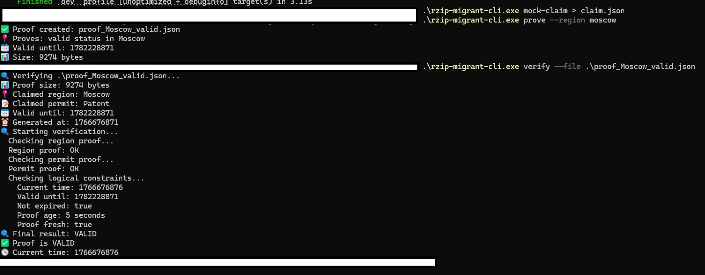

# Русская версия [(README)](./README_RU.md)

System for verifying the migration status of foreign citizens in Russia using the Zero-Knowledge Identity Protocol.

What the system can prove

With Zero-Knowledge Proofs, users can prove:

    1. That they are in an authorized region
    2. The type of permit (visa, temporary residence permit, permanent residence permit)
    3. Valid status (not expired, not revoked)
    4. Compliance with the terms of stay

## Demo

